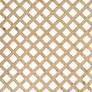

```{r setup, echo = FALSE, warnings = FALSE, message = FALSE}
plot_methods <- methods("plot")

library("graphics")
library("grid")
library("lattice")
library("ggplot2")

# Scales for ggplot2
library("scales")

# png files
library("png")

# Lo de siempre
library("magrittr")
library("dplyr")
library("tidyr")

# Datos para ejemplos
library("saber") # Ver github.com/nebulae-co/saber
library("forecast")

data("diamonds")
data("iris")
data("mtcars")

# Algunas opciones de knitr
library("knitr")

opts_knit$set(child.path = "graficas_files/")

opts_chunk$set(message = FALSE,
               comment = "#>",
               dev.args = list(bg = "transparent"))

theme_update(plot.background = element_rect(fill = "transparent",
                                            colour = "transparent"))
```

## Motivación

```{r motivacion, child = "motivacion.rmd"}
```

## Contenido (I)
<!-- Esto es solo para guiarnos luego miramos si lo dejamos o no --> 

- Qué es R: [bogota-r.github.io/intro](http://bogota-r.github.io/intro)
- Gráficas Base
    * Métodos - Todo de una: `plot()`
    * El modelo base
    * Estado y parámetros graficos: `par()`
    
- Grid
    * Qué es grid (o por qué otro sistema?)
    * El modelo grid
    * Componentes

## Contenido (II)
- lattice
    * Trellis plots
    
- ggplot2
    * Una gramática de gráficas: Capas, geometrías y componentes estéticos

## Contenido (III)
- Maś allá: gráficas interactivas
    * ggvis y shiny
    * Integración con JS y htmlwidgets

## Qué es R?

> *"R is a language and environment for statistical computing and graphics."*

Entre otras cosas R incluye:

  - capacidad para almacenar y manipular datos efectivamente
  - un conjunto de operadores para hacer cálculos sobre arreglos, particularmente matrices
  - una colección grande, coherente e integrada de herramientas para el análisis de datos
  - ### **dispositivos gráficos para el análisis y visualización de datos, tanto en pantalla como en impreso**
  - un lenguaje de programación bien desarrollado, simple y eficaz

## [El ambiente para graficas de R](https://cran.r-project.org/web/views/Graphics.html) {.smaller}

```{r graphics-diagram, child = "graphics-diagram.rmd"}
```

Gráfica basada en [codigo](https://www.stat.auckland.ac.nz/~paul/RGraphics/organisation-graphicslevels.R) del libro [*R Graphics* de Paul Murrell](https://www.stat.auckland.ac.nz/~paul/RGraphics/rgraphics.html)

## Básicamente

```r
library("graphics")
library("grid")

# http://lattice.r-forge.r-project.org/
library("lattice")

# https://github.com/hadley/ggplot2
library("ggplot2")
```

# Gráficas Base

## Métodos (o todo de una):

- `plot()` para "diagramas de dispersión"
- `barplot()` para gráficas de barra
- `hist()` para histogramas
- `boxplot()` (y `bxp()`)  para diagramas de cajas y bigotes
- `pie()` - mejor evitarlos

## `plot()`

```{r plot-0, eval = FALSE}
set.seed(13579)

y <- rnorm(30)
types <- c("p", "l", "b", "c", "o", "h", "s", "S", "n")

par(mfrow = c(3, 3), cex = 0.6, mar = c(3, 3, 3, 1))

for (type in types){
  plot(y, type = type, main = paste0("type = ", type))
}
```

## `plot()`

```{r plot-0, echo = FALSE}
```

## `plot()`

`plot()` es una función genérica. Hay muchas formas de especificar los datos y dependiendo de lo que se le pase se genera uno u otro tipo de gráfico.

Veamos unos ejemplos usando el conjunto de datos `iris`:

```{r iris-str}
str(iris)
```

## `plot()`

```{r plot-1}
plot(iris)
```

## `plot()`

```{r plot-2}
par(mfrow = c(1, 2), mar = c(5, 4, 2, 2))

plot(iris$Petal.Length, iris$Petal.Width)
plot(Petal.Length ~ Species, data = iris)
```

## `plot()` - Métodos

```{r plot-methods, eval = FALSE}
methods("plot")
```

```{r plot-methos-output, echo = FALSE}
plot_methods
```

## `barplot()` ... 

... pero antes unos datos más interesantes

```{r saber, eval = FALSE}
library("saber")  # Ver github.com/nebulae-co/saber
```

```{r saber-data, cache = TRUE}
data(SB11_20142)
# glimpse(SB11_20142)

estratos <- with(SB11_20142, table(PERS_GENERO, FINS_ESTRATOVIVIENDAENERGIA))
educacion_madre <- SB11_20142 %$% table(PERS_GENERO, FINS_NIVELEDUCATIVOMADRE)
```

## `barplot()`

```{r barplot, eval = FALSE}
par(mfrow = c(2, 1), mar = c(3, 5.5, 1, 1), cex = 0.95)

barplot(estratos, angle = c(45, 135), density = 20, col = "grey",
        names = colnames(estratos), xlab = "Estrato")

legend("topright", title = "Género", rownames(estratos), cex = 1.5,
       angle = c(45, 135), density = 20, fill = "gray")

barplot(educacion_madre, angle = c(45, 135), density = 20, 
        col = colors()[c(50, 100)], horiz = TRUE,
        names = colnames(educacion_madre), ylab = "Nivel Educativo\n Madre")
```

## `barplot()`

```{r barplot, echo = FALSE}
```

## `boxplot()` - `bxp()` 

```{r boxplot, eval = FALSE}
par(mfrow = c(1, 2), mar = c(4, 4, 4, 2), cex = 0.8)

boxplot(MATEMATICAS_PUNT ~ FINS_ESTRATOVIVIENDAENERGIA, data = SB11_20142,
        col = "light grey")

boxplot(MATEMATICAS_PUNT ~ FINS_ESTRATOVIVIENDAENERGIA, data = SB11_20142,
        pch = 1:6, boxwex = 0.5, boxfill = "lightblue", frame.plot = FALSE,
        main = "Distribución del puntaje\n de matemáticas por estrato",
        xlab = "Estrato", ylab = "Puntaje de matemáticas")
```

## `boxplot()` - `bxp()`

```{r boxplot, echo = FALSE}
```

## Gráficas para 3 ó más dimensiones

- `persp()` superficies.
- `contour()` y `filled.contour()` contornos.
- `image()` cuadrícula con colores en $z$.
- `symbols()` diagramas de dispersión con símbolos de tamaño variable.
- `fourfoldplot()` para tablas de contingencia $2\times 2\times k$.
- `mosaicplot()`
- `stars()` para una visualización de varias variables cuantitativas.

```{r multidimensional-plots, child = "multidimensional-plots.rmd"}
```

## Otras funciones gráficas de alto nivel:

- `matplot()` para gráficas de dispersión cruzando matrices.
- `stripchart()` gráfica de dispersión en una sola dimensión.
- `curve()` para gráficar funciones (como `plot.function()`).

## Algunas más modernas o específicas:
Además de los métodos específicos para `plot()`:

- `dotchart()` para resumir una variable cuantitativa cruzada con una o más variables categóricas.
- `coplot()` gráficas condicionales (Trellis).
- `sunflowerplot()` para diagramas de dispersión con datos superpuestos - alternativas para esto son `image()` o `hexbin::hexbin()`. 
- `assocplot()` visualización de una prueba de independencia para una tabla de contingencia bi-dimensional - `vcd` extiende esto y ofrece más herramientas para datos categóricos.

## El modelo gráfico base

- Márgenes externas
- Región de la figura
- Región de la gráfica $\rightarrow$ Sistema coordenado (`xlim` y `ylim` en funciones de alto nivel o `par("usr")`)
- Margen de la figura (Región de la figura - Región de la gráfica)

## El modelo gráfico base

```{r modelo, echo = FALSE}
par(oma = rep(3, 4), bg = "grey80")
plot(c(0, 1), c(0, 1), type = "n", ann = FALSE, axes = FALSE)
box("outer", col = "grey")
# set clipping to figure region
par(xpd = TRUE)
# deliberately draw a stupidly large rectangle
rect(-1, -1, 2, 2, col = "grey90")
box("figure")
# set clipping back to plot region
par(xpd = FALSE)
# deliberately draw a stupidly large rectangle
rect(-1, -1, 2, 2, col = "grey80")
box("plot", lty = "dashed")
text(.5, .5, "Plot Region")
mtext("Figure Region", side = 3, line = 2)
for (i in 1:4)
    mtext(paste("Outer margin", i), side = i, line = 1, outer = TRUE)
```

Gráfica basada en [código](https://www.stat.auckland.ac.nz/~paul/RGraphics/organisation-graphicslevels.R) del libro [*R Graphics* de Paul Murrell](https://www.stat.auckland.ac.nz/~paul/RGraphics/rgraphics.html)

##  `par()` y algunos parámetros gráficos

El sistema base mantiene un estado que se consulta y modifica con `par()`.

Podemos clasificar los parámetros de acuerdo a los componentes de las gráficas afectan y si son de alto nivel, bajo nivel o solo lectura. 

- Alto nivel: pueden ser con llamados a los métodos gráficos o con `par()`.
- Bajo nivel: solo pueden ser modificados a través de `par()`

```{r par, child = "par.rmd"}
```

## Componentes de bajo nivel

Función                     | Descripción   |
----------------------------|---------------|
`lines()` y `matlines()`    | Líneas        |
`points()` y `matpoints()`  | Puntos        |
`rect()`                    | Rectángulos   |
`poly()`                    | Polígonos     |
`segments()`                | Segmentos     |
`text()`                    | Texto         |

## Utilidades

Función                 | Descripción                     |
------------------------|---------------------------------|
`grid()`                | Cuadrículas                     |
`abline()`              | Rectas                          |
`arrows()`              | Flechas                         |
`box()`                 | Borde                           |
`rug()`                 | "Rug" en ejes                   |	
`mtext()`               | Texto en las márgenes           |	
`title()`               | Títulos y etiquetas de ejes     |	
`legend()`              | Leyenda                         |	

## Utilidades

Función                 | Descripción                     |
------------------------|---------------------------------|
`axis()` y `axTicks()`  | Ejes                            |	
`strheight()`           | Tamaños de caracteres           |	
`strwidth()`            | Tamaños de caracteres           |	
`xinch()`               | Transformaciones a coordenadas  |	
`yinch()`               | Transformaciones a coordenadas  |	
`xyinch()`              | Transformaciones a coordenadas  |	
`cm()`                  | Transformaciones a coordenadas  |

## Cómo hacer una función gráfica? {.smaller}

```{r template, eval = FALSE}
plot.newclass <- function(x, y = NULL, main = "", sub = "",  xlim = NULL, 
                          ylim = NULL, axes = TRUE, ann = par("ann"),
                          col = par("col"), ...){
  xy <- xy.coords(x, y)
  if (is.null(xlim))
    xlim <- range(xy$x[is.finite(xy$x)])
  if (is.null(ylim))
    ylim <- range(xy$y[is.finite(xy$y)])
  opar <- par(no.readonly = TRUE)
  on.exit(par(opar))
  plot.new()
  plot.window(xlim, ylim, ...)
  points(xy$x, xy$y, col = col, ...)
  if (axes) {
    axis(1)
    axis(2)
    box()
  }
  if (ann) 
    title(main = main, sub = sub, 
          xlab = xy$xlab, ylab = xy$ylab, ...)
}
```

[Código por Paul Murrell](https://www.stat.auckland.ac.nz/~paul/RGraphics/custombase-template.R)

## Cómo hacer una función gráfica? {.smaller}

```{r png_meme_generator}
png_meme_generator <- function(x, main, sub){
  con <- url(x, open = 'rb')
  rawpng <- readBin(con, what = 'raw', n = 50000)
  close(con)
  
  img <- png::readPNG(rawpng)
  
  old_par <- par(no.readonly = TRUE)
  on.exit(par(old_par))
  par(xpd = NA, mgp = c(0, 0, 0), oma = c(0, 0, 0, 0), ann = F)
  
  plot.new()
  plot.window(0:1, 0:1)
  
  usr <- par("usr")    
  rasterImage(img, usr[1], usr[3], usr[2], usr[4])
  
  text(.5, 1.05,  main, cex = 2, col = "#000000", pos = 3)
  text(.5, -.05,   sub, cex = 2, col = "#000000", pos = 1)
}
```

##  Una nueva función gráfica:

```{r meme, fig.width = 5, fig.align = "center"}
png_meme_generator(
  "http://i2.kym-cdn.com/photos/images/original/000/208/140/1322357772581.png",
  "Tu cara cuando ves", 
  "un meme hecho en R")
```

# Grid

## Qué es grid?

Un sistema gráfico alternativo, flexible y poderoso.

Tres componentes:

- "puertos" (_viewports_)
- unidades `?units`
- parámetros gráficos `?gpar`
- Estructura de arbol. Objetos grafics o `grob`s.

Grid solo ofrece componentes de bajo nivel.

## Puertos

Region rectangular que proporciona un contexto para dibujar.

Contexto para dibujar:
  - Contexto geometrico: sistema coordenado
  - Contexto gráfico: parametros gráficos

## Grid

```{r grid-0}
v <- viewport(x = 0.6, y = 0.6, w = unit(1, "inches"), h = unit(1, "inches"))
grid.show.viewport(v)
```

## Lattice

## Que es lattice?

Laticce es una libreria que proporciona funciones gráficas de alto nivel basadas en `grid` y útiles para generar gráficas para datos multivariados a través de condicionamiento (_Trellis plots_) basado en trabajo e ideas de [William Cleveland](http://www.stat.purdue.edu/~wsc/).    



## Lattice

* Está basado en el paquete `grid` y por lo tanto hereda gran parte de sus características.
* La visualización con Trellis se define por el tipo de gráfica y los roles de las variables, los más comunes son:
 
  * Variables primarias
  * Variables que condicionan
  * Variables de agrupamiento

`lattice` utiliza una interfaz de fórmula:
  - `~ x | A`:  graficar la variable `x` para cada nivel de `A`.
  - `y ~ x | A * B` graficar la relación entre las variables numéricas `y` y `x` para cada combinación de niveles de los "factores" `A` y `B`.

## Lattice

```{r lattice-0, echo = FALSE}
x <- 1:5
y <- 1:5
g <- factor(1:5)
types <- c("barchart", "bwplot", "densityplot", "dotplot",
           "histogram", "qqmath", "stripplot", "qq",
           "xyplot", "levelplot", "contourplot",
           "cloud", "wireframe", "splom", "parallelplot")
angle <- seq(0, 2*pi, length=19)[-19]
xx <- cos(angle)
yy <- sin(angle)
gg <- factor(rep(1:3, each=6))

aaa <- seq(0, pi, length=10)
xxx <- rep(aaa, 10)
yyy <- rep(aaa, each=10)
zzz <- sin(xxx) + sin(yyy)


doplot <- function(name, ...) {
  do.call(name, 
          list(..., scales=list(draw=FALSE), xlab=NULL, ylab=NULL,
               strip=function(which.panel, ...) { 
                 grid.rect(gp=gpar(fill="gray90")); grid.text(name) 
               }))
}
plot <- vector("list", 15)
plot[[1]] <- doplot("barchart", y ~ g | 1)
plot[[2]] <- doplot("bwplot", yy ~ gg | 1, 
                    par.settings=list(box.umbrella=list(lwd=0.5)))
plot[[3]] <- doplot("densityplot", ~ yy | 1)
plot[[4]] <- doplot("dotplot", g ~ y | 1)
plot[[5]] <- doplot("histogram", ~ xx | 1)
plot[[6]] <- doplot("qqmath", ~ yy | 1)
plot[[7]] <- doplot("stripplot", yy ~ gg | 1)
plot[[8]] <- doplot("qq", gg ~ yy | rep(1, 18), subset=gg != 3)
plot[[9]] <- doplot("xyplot", xx ~ yy | 1)
plot[[10]] <- doplot("levelplot", zzz ~ xxx + yyy | 1, colorkey=FALSE)
plot[[11]] <- doplot("contourplot", zzz ~ xxx + yyy | 1, labels=FALSE, cuts=8)
plot[[12]] <- doplot("cloud", zzz ~ xxx + yyy | 1, zlab=NULL, zoom=0.9, 
                     par.settings=list(box.3d=list(lwd=0.1)))
plot[[13]] <- doplot("wireframe", zzz ~ xxx + yyy | 1, zlab=NULL, zoom=0.9,
                     drape=TRUE, par.settings=list(box.3d=list(lwd=0.1)),
                     colorkey=FALSE)
plot[[14]] <- doplot("splom", ~ data.frame(x=xx[1:10], y=yy[1:10]) | 1, 
                     pscales=0)
plot[[15]] <- doplot("parallelplot", ~ as.data.frame(split(yy, gg)) | 1)

grid.newpage()
pushViewport(viewport(layout=grid.layout(4, 4)))
for (i in 1:15) {
  pushViewport(viewport(layout.pos.col=((i - 1) %% 4) + 1,
                        layout.pos.row=((i - 1) %/% 4) + 1))
  print(plot[[i]], newpage=FALSE, 
        panel.width=list(1.025, "inches"),
        panel.height=list(1.025, "inches"))
  popViewport()
}
popViewport()
```

## Lattice - Funciones de alto nivel

Gráfica       | Descripción                            | Ejemplo de fórmula  | 
--------------|----------------------------------------|---------------------|
histogram()   | Histograma                             | `~ x`               |
densityplot() | Gráfica de "densidad kernel"           | `~ x | A * B`       |
qqmath()      | Gráfica de cuantiles teóricos          |                     |
qq()          | Gráfica de cuantiles para dos muestras |                     |
stripplot()   | Stripchart                             | `A ~ x`  ó  `x ~ A` |
bwplot()      | Box-Plots comparativos                 | `x ~ A` ó `A ~ x`   |
dotplot()     | Gráfica de puntos (de Cleveland)       | `~ x | A`           |
barchart()    | Gráfica de barras                      | `x ~ A` ó `A ~ x`   |

## Lattice - Funciones de alto nivel

Gráfica         | Descripción                            | Ejemplo de fórmula  | 
----------------|----------------------------------------|---------------------|
xyplot()        | Diagrama de dispersión                 | `y ~ x | A`         |
splom()         | Matriz de diagramas de dispersión      | `data.frame`        |
contourplot()   | Gráfica de contornos para superficies  | `z ~ x * y`         |
levelplot()     | _False color level plot of surfaces_   | `z ~ y * x`         |
wireframe()     | Gráfica de perspectiva 3D              | `z ~ y * x`         |
cloud()         | Diagrama de dispersión 3D              | `z ~ x * y | A`     |
parallelplot()  | Gráfica de coordenadas paralelas       | `data.frame`        |

## Lattice - Ejemplo (I)

```{r lattice-1, eval = FALSE}
histogram(~ MATEMATICAS_PUNT, data = SB11_20142, xlab = "Puntaje Matemáticas", 
          ylab = "Frecuencia relativa")
```

## Lattice - Ejemplo (I)

```{r lattice-1, echo = FALSE}
```

## Lattice - Ejemplo (II)

```{r lattice-2, eval = FALSE}
histogram(~ MATEMATICAS_PUNT | factor(FINS_ESTRATOVIVIENDAENERGIA),
          data = SB11_20142, xlab = "Puntaje Matemáticas", 
          ylab = "Frecuencia relativa")
```

## Lattice - Ejemplo (II)

```{r lattice-2, echo = FALSE}
```

## Lattice - Ejemplo (III)

```{r lattice-3, eval = FALSE}
densityplot(~ MATEMATICAS_PUNT | factor(FINS_ESTRATOVIVIENDAENERGIA),
            data = SB11_20142, groups = PERS_GENERO,
            plot.points = FALSE, auto.key = TRUE, xlab = "Puntaje Matemáticas",
            ylab = "Densidad")
```

## Lattice - Ejemplo (III)

```{r lattice-3, echo = FALSE}
```

## Lattice - Ejemplo (IV)

```{r lattice-4, eval = FALSE}
xyplot(LECTURA_CRITICA_PUNT ~ MATEMATICAS_PUNT | 
       factor(FINS_ESTRATOVIVIENDAENERGIA) * factor(PERS_GENERO),
       data = SB11_20142, xlab = "Puntaje Matemáticas", 
       ylab = "Puntaje Lectura Crítica")
```

## Lattice - Ejemplo (IV)

```{r lattice-4, echo = FALSE}
```


# ggplot2

## R moderno o el ["Hadleyverse"](https://barryrowlingson.github.io/hadleyverse/)

- `readr`, `readxl` y `haven` lectura de archivos.
- `lubridate` manejo de fechas y tiempo.
- `stringr` interface a `stringi` para manejo de caracteres.
- `dplyr` y `tidyr` manipulación y limpieza de datos.
-  ### `ggplot2` **una gramática de gráficas - util para abstraer y construir visualizaciones**.

## ggplot2 - Una Gramatica de Graficas

- Capas:
    * Datos +
    * Estadísticas +
    * Componentes estéticos +
    * Geometría
    
```{r, eval = FALSE} 
ggplot(...) +
  layer(...) +
  layer(...) +
  helper(...) +
  helper(...) +
  theme(...)
```

## ggplot2 - Una Gramática de Gráficas

```{r qplot, echo = FALSE, fig.height = 3.5}
ggplot(mtcars) + 
  aes(x = mpg, y = wt , colour = factor(cyl)) + 
  geom_point()
```

## [ggplot2 - geometrías y estadísticas](geoms.html)

```{r geoms-intro}
ggplot(mtcars) + aes(y = mpg, x = factor(cyl)) + geom_violin()
```

# Más allá: Gráficas interactivas

# ggvis y shiny

# Integración con JS - htmlwidgets

## Ayuda y otros recursos

La vista de tareas con la que empezamos: [_Vista de Tareas_/Gráficas](http://cran.r-project.org/web/views/Graphics.html).

Canales: [en twitter #rstats](https://twitter.com/hashtag/rstats) y en [StackOverflow el tag R](http://stackoverflow.com/questions/tagged/r). También pueden [googlea-R](https://www.google.com.co/#q=R) R + "pregunta".  

Algunas buenas referencias:

- [Quick R - Gráficas](http://www.statmethods.net/graphs/index.html)
- [Springer - Use R Series](http://www.springer.com/series/6991?detailsPage=titles) R en la práctica en diferentes contextos.
- [La pagina de Paul Murrel](https://www.stat.auckland.ac.nz/~paul/)
- ...

## Colofón {.smaller .left-margin}

Esta presentación fue escrita en RMarkdown desde RStudio y compilada por `rmarkdown` en la plantilla `ioslides` de Google gracias a `knitr` y `pandoc`. Publicada en la web en GitHub gracias a GitHub Pages.

### [**bogota-r.github.io/graficas**](http://bogota-r.github.io/graficas)
